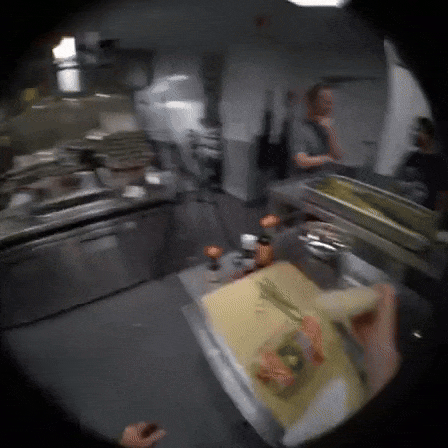

# Ego2Exo: A Video Domain Adaptation Dataset with Natural Language Captions.

## [[Download](https://drive.google.com/file/d/1pe4F8zYSfA-VYvx296opzHpggrzV-jYE/view?usp=sharing)]

<div style="display:flex;">
    
    
</div>

## Dataset Download Instructions


## Dataset Preparation


## LagTraAn on Ego2Exo


### Citation

If this code or the Ego2Exo dataset helps in your work, please consider citing our original paper. 
``` text
@article{kalluri2024lagtran,
        author    = {Kalluri, Tarun and Majumder, Bodhisattwa and Chandraker, Manmohan},
        title     = {Tell, Don`t Show! Language Guidance Eases Transfer Across Domains in Images and Videos},
        journal   = {ICML},
        year      = {2024},
        url       = {https://arxiv.org/abs/2403.05535},
      },
```
