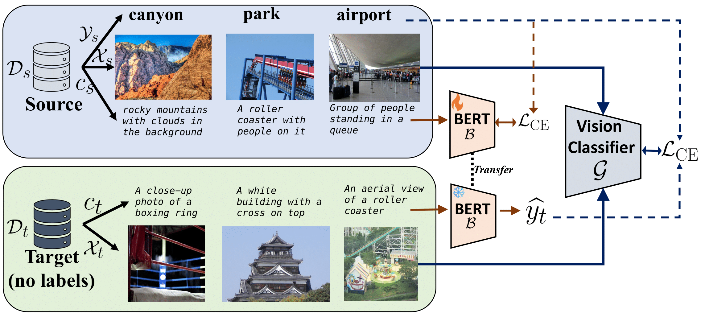
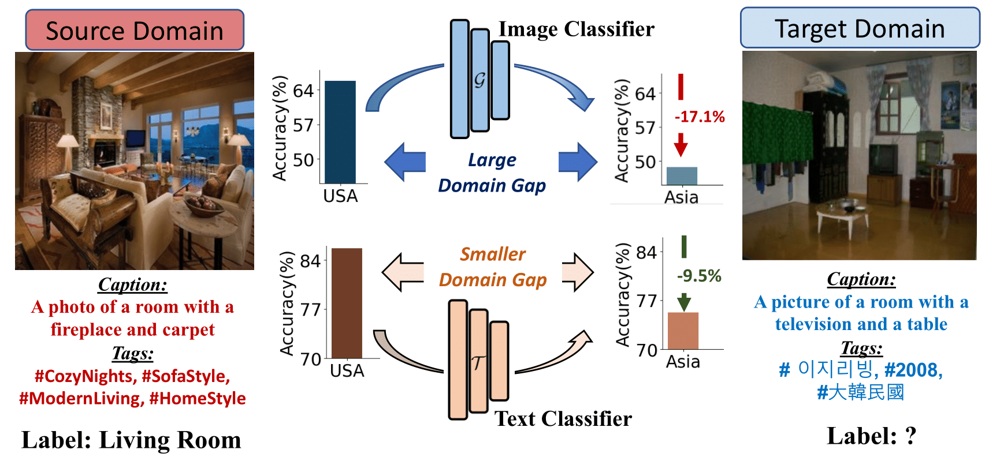

# Tell, Don`t Show!: Language Guidance Eases Transfer Across Domains in Images and Videos (ICML 2024)

## [[project page](https://tarun005.github.io/lagtran/)] [[paper](https://arxiv.org/abs/2403.05535)]

<div style="text-align:center;">

</div>


### Abstract
The current standard of unsupervised domain adaptation lacks mechanism for incorporating text guidance. We propose a novel framework called LaGTrAn, which leverages natural language to guide the transfer of discriminative knowledge from labeled source to weakly labeled target domains in image and video classification tasks. Despite its simplicity, LaGTrAn is highly effective on a variety of benchmarks including GeoNet and DomainNet. We also introduce a new benchmark called Ego2Exo to facilitate robustness studies across viewpoint variations in videos, and show LaGTrAn's effeciency in this novel transfer setting. This repository contains the original source code used to train the language and image classifier models in LaGTrAn as well as the trained models. 

<div style="text-align:center;">

</div>

### Requirements

You can use the requirements.txt file to create a new environment or install required packages into existing environments. The following are recommended:
1. Pytorch>=2.0
2. torchvision>=0.14.1
3. timm=0.9.10
4. transformers>=4.30.1
5. tokenizers=0.19.1

### Datasets and metadata

You can access the textual captions and metadata used in our work in the following links. You can find them in the following links. Please refer to this page for dataset and metadata for Ego2Exo.  
1. GeoNet: Metadata Link.
2. DomainNet: Metadata Link. 

Download the metadata and places them inside a folder named `metadata`. You can download the original images from the respective webpages: GeoNet and DomainNet. 

### Ego2Exo: A new video adaptation benchmark.

We leverage the recently proposed [Ego-Exo4D](https://docs.ego-exo4d-data.org/) dataset to create a new benchmark called Ego2Exo to study ego-exo transfer in videos. Ego2Exo contains videos from both egocentric and exocentric viewpoints, and is designed to facilitate robustness studies across viewpoint variations in videos. The complete details to download the videos and metadata for Ego2Exo is available here. 

### Training.

The training for LagTrAn proceeds in two phases - where we first train the text classifier module, and then use the pseudo-labels derived from that to train the image classification module. Note that the metadata 

Text Classification on 

1. GeoNet: 
```
python3 bert_classification.py --dataset [GeoPlaces|GeoImnet] --source usa --target asia --root_dir <data_dir>
```

2. DomainNet:
```
python3 bert_classification.py --dataset DomainNet --source real --target clipart --root_dir <data_dir>
```

The trained BERT checkpoints along with the pseudo-labels should be download into `bert_checkpoints` and `pseudo_labels` respectively. The pseudo labels can then be used to train the downstream adaptation network as follows. 

Domain Adaptation on GeoPlaces:
```
python3 train.py --config configs/lagtran.yml --source usa --target asia --dataset [GeoPlaces|GeoImnet] --data_root <data_dir> --exp_name <exp_name> --trainer lagtran
```

Domain Adaptation on DomainNet:
```
python3 train.py --config configs/lagtran.yml --source real --target clipart --dataset DomainNet --data_root <data_dir> --exp_name <exp_name> --trainer lagtran
```

### Trained Models.

You can directly download the target-adapted models (along with the training logs) for GeoNet dataset at the following links. All models use a ViT-B/16 backbone pre-trained on ImageNet and trained using LagTrAn. 

|   |  USA -> Asia | Asia -> USA |
|---|---|---|
| GeoPlaces | 56.14 [Link] | 57.02 [Link] |
| GeoImnet | 63.67 [Link] | 64.16 [Link] |

#### Testing.

If you just want to compute the accuracy using the pre-trained models, you may download the models and use the following command. 

```
python3 test.py --config configs/test.yml --target asia --data_root <data_dir> --saved_model <checkpoint_dir>/best_model.pkl  --dataset [GeoPlaces|GeoImnet]
```

### Citation

If this code or our work helps in your work, please consider citing us. 
``` text
@article{kalluri2024lagtran,
        author    = {Kalluri, Tarun and Majumder, Bodhisattwa and Chandraker, Manmohan},
        title     = {Tell, Don`t Show! Language Guidance Eases Transfer Across Domains in Images and Videos},
        journal   = {ICML},
        year      = {2024},
        url       = {https://arxiv.org/abs/2403.05535},
      },
```
